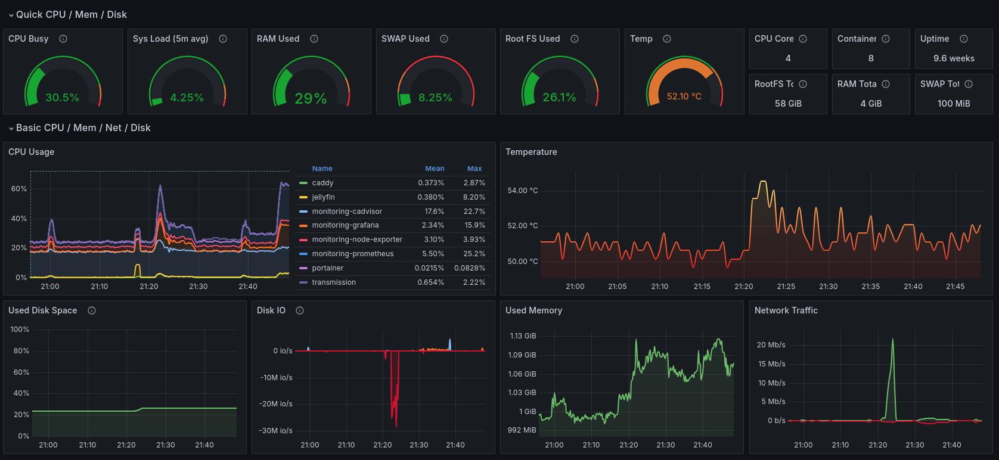
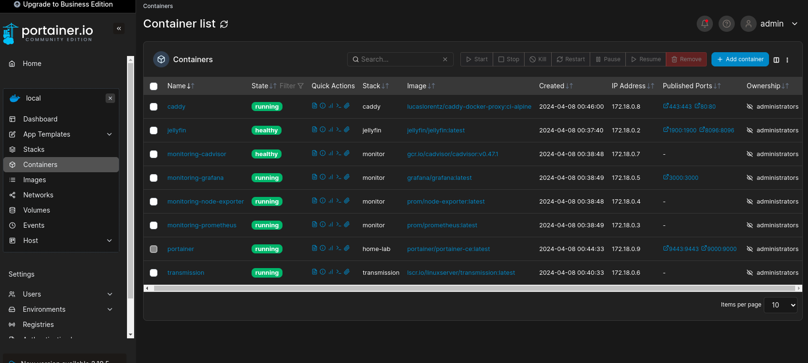
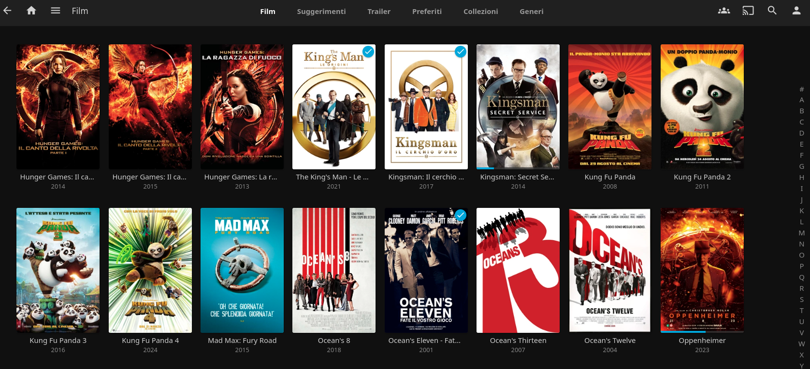

# Raspberry Pi Home Lab 🏡

## Introduction 📚

Welcome to the Raspberry Pi Home Lab project! This project aims to provide a comprehensive and user-friendly way to set up a home server using your Raspberry Pi. The server includes monitoring, media downloading, and media serving functionalities, all secured and managed by Caddy.

This project is based on the following components:

- 📊 [Grafana](http://grafana.org/), 🛠️ [Prometheus](https://prometheus.io/), 🖥️ [cAdvisor](https://github.com/google/cadvisor), and 🖧 [NodeExporter](https://github.com/prometheus/node_exporter) for monitoring.
- 📥 [Transmission](https://transmissionbt.com/) for media downloading.
- 🎥 [Jellyfin](https://jellyfin.org/) for media serving.
- 🌐 [Caddy](https://caddyserver.com/) for managing TLS and SSH, exposing only the necessary services.
- ⚙️ [Portainer](https://www.portainer.io/) for managing Docker containers via a web interface.

## Services 🔧

### Security 🔒

All these services are secured and managed by Caddy. Caddy simplifies your server's configuration, handles HTTPS automatically, and ensures that all your services are only exposed as defined in each Docker Compose file.

### Monitoring 📈

The monitoring solution uses Grafana, Prometheus, cAdvisor, and Node-Exporter Stack. With Grafana's intuitive dashboards, you can easily visualize system metrics collected by Prometheus and cAdvisor, while Node-Exporter provides valuable information about the Raspberry Pi's hardware and operating system.

### Container Management ⚙️

Portainer is used for managing Docker containers. It provides a simple and easy-to-use web interface for managing your Docker environment, allowing you to deploy, configure, and troubleshoot your containers effortlessly.
### Media Downloading 📥

Transmission is used for media downloading. It is a fast, easy, and free BitTorrent client with a robust set of features.

### Media Serving 🎬

Jellyfin is used for media serving. It is a free software media system that lets you control your media from a web interface.

### Container Management ⚙️

Portainer is used for managing Docker containers. It provides a simple and easy-to-use web interface for managing your Docker environment, allowing you to deploy, configure, and troubleshoot your containers effortlessly.